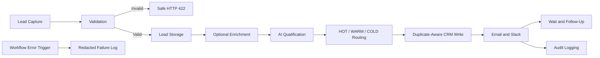

# n8n Automation Portfolio

This repository contains credential-free n8n workflow templates for common sales and operations use cases. The workflows are designed to demonstrate practical automation structure: validation before side effects, safe failure responses, duplicate-aware CRM writes, configurable AI steps, notifications, delayed follow-up, and centralized error reporting.

The templates are portfolio examples. They do not contain client data, production credentials, or claims about revenue, conversion rates, or production-scale performance.

## Included Workflows

| Workflow | Purpose | External services |
| --- | --- | --- |
| [AI Sales Automation Workflow](workflow/ai-sales-automation.json) | Captures, validates, qualifies, routes, and follows up with inbound leads | OpenAI API, HubSpot, Gmail, Slack, Google Sheets, optional enrichment API |
| [Lead Validation Webhook](workflow/lead-validation-webhook.json) | Reusable webhook boundary that normalizes valid leads and safely rejects invalid requests | None |
| [Workflow Error Alert Handler](workflow/workflow-error-alert-handler.json) | Redacts execution failures before optional Slack and Google Sheets reporting | Slack, Google Sheets |

External-service nodes are disabled in the exports. This makes the templates safe to inspect and import without accidentally contacting providers. Configure credentials and placeholder IDs, test with non-sensitive data, and then enable only the nodes you intend to use.

# AI Sales Automation Workflow

## Overview

Inbound leads often arrive with inconsistent fields, missing identifiers, duplicated submissions, and no consistent prioritization. This workflow provides a structured intake pipeline that validates a request before any enrichment, CRM write, or marketing email occurs. Accepted leads can be enriched, scored, routed, written to HubSpot, logged, and followed up automatically.

The included export is a configurable starter implementation. Core validation and fallback scoring run without credentials. Provider nodes are present but disabled until the repository user configures them.

## Workflow Architecture



Concise sequence:

**Lead Capture → Validation → Storage → Enrichment → AI Qualification → Routing → CRM → Notifications → Follow-Up → Error Logging**

## Main Features

- POST webhook for structured lead capture.
- Normalization for email addresses, names, company fields, consent, and request identifiers.
- Safe validation branch that returns HTTP 422 without calling downstream providers.
- Optional Google Sheets lead log and company-enrichment request.
- Configurable OpenAI qualification request with a deterministic fallback score.
- Explicit HOT, WARM, and COLD routing branches.
- HubSpot request-ID search followed by normalized-email fallback search.
- Contact update when a duplicate is found and contact creation when no match is found.
- Consent-aware Gmail message path, Slack notification, audit log, Wait node, and follow-up email.
- Separate error-trigger workflow that redacts error details before optional reporting.

## Lead Validation

The validation Code node accepts the webhook body, trims supported string fields, lowercases the email address, normalizes the company domain, and converts common consent values to a boolean. It rejects malformed requests with a short list of field-level validation messages.

Validation happens before storage, enrichment, AI calls, CRM writes, or email. Invalid requests return a controlled HTTP 422 response containing only the request identifier, status, and validation messages. Raw payloads, stack traces, provider responses, and credentials are not returned.

## AI Lead Qualification

The OpenAI HTTP Request node is configured to send only normalized business lead fields needed for qualification. Its prompt requests a JSON result containing a score and concise reason. The following Code node bounds the score to 0–100 and maps it to:

- **HOT:** 80–100
- **WARM:** 50–79
- **COLD:** 0–49

If the AI node is disabled or does not return valid JSON, the template uses a small, documented rules-based fallback. This keeps routing deterministic during local review; it is not presented as an AI result.

## CRM Automation

The HubSpot path demonstrates duplicate-aware contact handling:

1. Search a custom `n8n_request_id` contact property when `request_id` is available.
2. If no request-ID match exists, search by normalized email.
3. Update the matching contact or create a new one only after the searches complete.

The HubSpot HTTP nodes are disabled by default and use environment-variable placeholders for authentication. The custom property and field mappings must be reviewed against the target HubSpot portal before enabling the nodes.

## Notifications and Follow-Up

Valid HOT and WARM leads with consent can enter the Gmail path. All accepted leads can produce a Slack sales notification and Google Sheets audit entry once those nodes are configured. The response is sent before the delayed branch. Eligible leads then enter a two-day Wait node before the optional follow-up email.

No marketing email path is reachable from the invalid-request branch.

## Reliability and Error Handling

- Side effects occur only after validation succeeds.
- `request_id` is the first duplicate key; normalized email is the fallback.
- Provider credentials and identifiers are placeholders, and external nodes start disabled.
- AI parsing validates the provider response and falls back safely when necessary.
- Webhook responses expose controlled status fields instead of raw provider errors.
- A separate Error Trigger workflow removes stack traces, credentials, request bodies, and provider payloads from its output.
- The repository does not claim exactly-once processing. Production use should add a durable idempotency store, retry policy, timeouts, and monitoring appropriate to the deployment.

## Tech Stack

Only technologies represented by nodes in the supplied exports are listed:

- n8n
- Webhook, Respond to Webhook, Code, If, HTTP Request, Wait, Error Trigger, and Schedule-compatible workflow patterns
- OpenAI API
- HubSpot CRM API
- Gmail
- Slack API
- Google Sheets
- Optional HTTP-based company enrichment provider

## Screenshots

Screenshots are intentionally not included yet because the templates have not been connected to a live n8n instance. After configuration, add a sanitized workflow overview image without execution payloads, account names, webhook URLs, or credential selectors.

## Workflow Exports

Sanitized, importable JSON exports are stored in [`workflow/`](workflow/). They contain no credential objects. See [Configuration and testing](docs/configuration.md) before enabling provider nodes.

## Security

- Credentials are not included.
- API keys are removed and represented only by environment-variable names.
- OAuth credentials and tokens are not included.
- Webhook secrets are not included.
- Personal and client data is not included.
- Account, sheet, CRM, channel, and workflow identifiers use placeholders.
- External-service nodes are disabled by default.

See [SECURITY.md](SECURITY.md) for the publication and deployment checklist.

## Possible Business Use Cases

- Inbound sales lead automation
- CRM lead routing and duplicate-aware contact handling
- AI-assisted lead qualification
- Consent-aware automated follow-up
- Sales-team notifications
- Safe webhook validation boundaries
- Centralized workflow failure alerts

## Import and Review

1. Download or clone this repository.
2. In n8n, import a JSON file from [`workflow/`](workflow/).
3. Review every Code node and field mapping.
4. Configure credentials in n8n or replace the documented environment-variable expressions.
5. Replace placeholder sheet, channel, model, and CRM property values.
6. Test the invalid branch first, then test valid and duplicate submissions with non-sensitive sample data.
7. Enable provider nodes individually only after their test succeeds.
8. Keep each workflow inactive until webhook authentication, error handling, and data-retention settings are appropriate for the deployment.

The repository includes a lightweight structural validator:

```bash
node scripts/validate-workflows.mjs
node scripts/test-core-logic.mjs
```

The validator checks JSON parsing, node and connection integrity, JavaScript syntax, inactive workflow state, disabled external nodes, invalid-branch isolation, credential references, and common secret formats. The core test script exercises validation, normalization, AI fallback/parsing, and failure redaction. These checks do not replace importing and testing the workflows in the target n8n version.

## What This Portfolio Demonstrates

These examples show how I structure n8n automations around business rules, validation boundaries, API integrations, CRM synchronization, AI-assisted decisions, notifications, and operational safeguards. Similar patterns can be adapted to a client's actual forms, CRM schema, messaging tools, approval rules, and hosting environment.

## License

The repository is available under the [MIT License](LICENSE).
